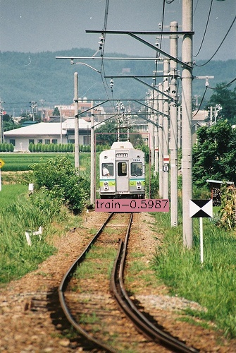
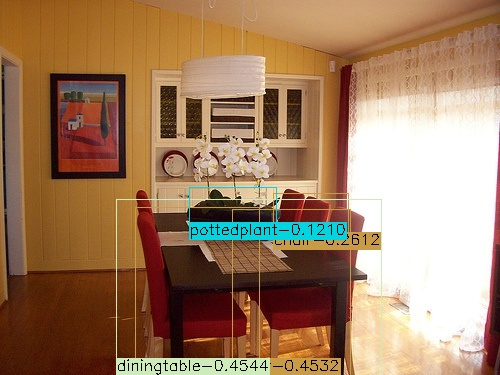
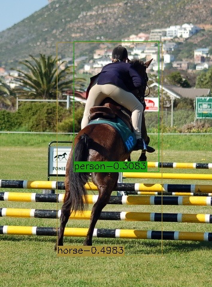

# keras-CenterNet
This is an implementation of [CenterNet](https://arxiv.org/abs/1904.07850) for object detection on keras and Tensorflow. The project is based on [fizyr/keras-retinanet](https://github.com/fizyr/keras-retinanet)
and the official implementation [xingyizhou/CenterNet](https://github.com/xingyizhou/CenterNet). 
Thanks for their hard work. 

The network is anchor-free. It is quite simple, fast and accurate. 

## Test
1. I trained on Pascal VOC2012 trainval.txt + Pascal VOC2007 train.txt, and validated on Pascal VOC2007 val.txt. There are 14041 images for training and 2510 images for validation.
2. The best evaluation results (score_threshold=0.01, flip_test=True, nms=True) on VOC2007 test are: 

| backbone | mAP50 |
| ---- | ---- |
| resnet50 | 0.7290 | 

3. Pretrained model is here. [baidu netdisk](https://pan.baidu.com/s/1nZz7PBIwshep5xXm-HrNCQ) extract code: pti9
4. `python3 inference.py` to test your image by specifying image path and model path there. 

 

## Train
### build dataset (Pascal VOC, other types please refer to [fizyr/keras-retinanet](https://github.com/fizyr/keras-retinanet))
* Download VOC2007 and VOC2012, copy all image files from VOC2007 to VOC2012.
* Append VOC2007 train.txt to VOC2012 trainval.txt.
* Overwrite VOC2012 val.txt by VOC2007 val.txt.
### train
* STEP1: `python3 train.py --freeze-backbone --gpu 0 --random-transform --compute-val-loss --batch-size 32 --steps 1000 pascal datasets/VOC2012` to start training. The init lr is 1e-3 and decays to 1e-4 when loss is stop dropping down.
* STEP2: `python3 train.py --snapshot xxx.h5 --gpu 0 --random-transform --compute-val-loss --batch-size 32 --steps 1000 pascal datasets/VOC2012` to start training when val mAP can not increase during STEP1. The init lr is 1e-4 and decays to 1e-5 when loss is stop dropping down.
## Evaluate
* `python3 eval/common.py` to evaluate by specifying model path there.